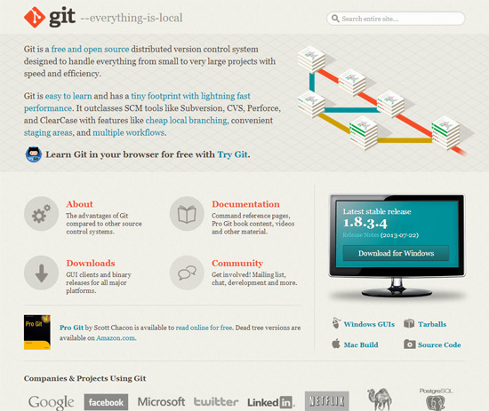

# 如何快速开始使用Git[^ref]

对于版本控制的最基本认识是，它越来越成为每一个面向编码工作的人——无论是软件开发人员、网站设计师甚至是在团队中配合开发者工作的图形设计人员——所必须掌握的能力。

除去众所周知的一些方面之外，还有许多原因可以解释为什么要使用版本控制系统（VCS）。

## 为什么需要用到版本控制

依靠版本控制可以使[团队合作](https://www.webpagefx.com/blog/web-design/the-key-to-successful-collaboration/)变得更简单易行。在没有版本控制存在的情况下，团队中的每个人员不过就是面向同一组共享的文件而已。这种情况下，发生某人把另一个人工作结果给覆盖了的情况是迟早的事情。

而VCS本身就是负责可以将不同人员的变更合并到一个共同的版本中，这在版本控制中的术语被称作**合并**。因此，工作中同时修改同样的文件成为一件可行而安全的事情了。

即便不存在团队，只有你自己一个人在战斗时，VCS仍然能够为你提供很多好处。

比如，版本控制系统让你的项目很轻松的保存和恢复各个版本记录。

而在没有VCS的辅助时，你很可能会依赖对文件和文件夹采用你自己奉行的命名方式来维持版本的备份，这是非常冒险的一种方式，最终将导致令人发指的文件和文件夹数量，而更可悲的是文件名大概会像`website-relaunch-homepage_2013-10-11_v3_JenniferSmith.html`此类的构造。

如果此处有VCS伴随，你仅需要在硬盘上维护唯一一个项目文件夹即可。所有其它的版本变体都安全的存在了版本控制系统的数据库中，每个版本都备有灵巧整洁的描述，随时方便你恢复到任何所期望的时刻。

最后，还要强调一点，使用VCS的一个优点是它本身是作为文档执行的，同时也可以帮助促进其它文档的生成。

因为每次重要的修改都被包裹进一次称为**提交**的操作中，并且每次**提交**时都要提供一些此次操作的描述信息，所以你可以非常容易的跟从并理解项目每一次增加的变化。一旦项目出现问题时，这对你查找问题出现的源头将非常有用。

## 为什么要使用Git

[市场上存在很多的版本控制系统类的软件](https://www.webpagefx.com/blog/web-design/the-ultimate-guide-to-version-control-for-designers/)，它们都存在各自的优缺点。

但是，有太多理由决定了你一定要选择使用**Git**。

[Git](http://git-scm.com/)可以说是当下开源版本控制系统中最流行的一款了。

作为一款[分布式版本控制系统](http://en.wikipedia.org/wiki/Distributed_revision_control)，Git提供了：

- 难以置信的速度
- 离线工作的能力
- 完整拷贝(包括项目的历史记录)的优势

Git的另一大显著特点就是优秀的**分支**管理能力。尽管其他的版本控制系统也持有**分支**的理念，但Git是彻底围绕这个理念建立的，它提供了一种超级简单快速的分支使用体验。一旦真正理解了，凭借此理念可以把代码质量提升一个层次。

至于其它一些概念，像**暂存区**或者**贮藏**等，也同样能让你感觉到Git是在你编写代码过程中一款非常有用的工具。

当你选择一款工具时，你头脑中还应该考虑一个因素：人气。如果一款工具在市场上没人使用，也没有社区，文档也不太健全，不能被其它系统集成，恐怕它也不会存活太久了。

Git早已进入主流。很多项目像Linux、Ruby on Rails、jQuery以及很多其他的重要开源项目，当然还有很多大公司（Google、Facebook和Twitter等）都在使用它。由此可见，Git的品质和生命期都是有保证的。

[^ref]: 本文摘自 https://www.webpagefx.com/blog/web-design/easy-git-tutorial/