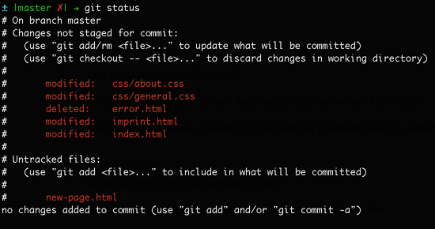
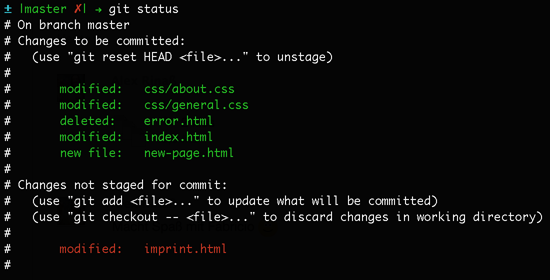

# 如何快速开始使用Git[^ref]


对于版本控制的最基本认识是，它越来越成为每一个面向编码工作的人——无论是软件开发人员、网站设计师甚至是在团队中配合开发者工作的图形设计人员——所必须掌握的能力。

除去众所周知的一些方面之外，还有许多原因可以解释为什么要使用版本控制系统（VCS）。

## 为什么需要用到版本控制

依靠版本控制可以使[团队合作](https://www.webpagefx.com/blog/web-design/the-key-to-successful-collaboration/)变得更简单易行。在没有版本控制存在的情况下，团队中的每个人员不过就是面向同一组共享的文件而已。这种情况下，发生某人把另一个人工作结果给覆盖了的情况是迟早的事情。

而VCS本身就是负责可以将不同人员的变更合并到一个共同的版本中，这在版本控制中的术语被称作**合并**。因此，工作中同时修改同样的文件成为一件可行而安全的事情了。

即便不存在团队，只有你自己一个人在战斗时，VCS仍然能够为你提供很多好处。

比如，版本控制系统让你的项目很轻松的保存和恢复各个版本记录。

而在没有VCS的辅助时，你很可能会依赖对文件和文件夹采用你自己奉行的命名方式来维持版本的备份，这是非常冒险的一种方式，最终将导致令人发指的文件和文件夹数量，而更可悲的是文件名大概会像`website-relaunch-homepage_2013-10-11_v3_JenniferSmith.html`此类的构造。

如果此处有VCS伴随，你仅需要在硬盘上维护唯一一个项目文件夹即可。所有其它的版本变体都安全的存在了版本控制系统的数据库中，每个版本都备有灵巧整洁的描述，随时方便你恢复到任何所期望的时刻。

最后，还要强调一点，使用VCS的一个优点是它本身是作为文档执行的，同时也可以帮助促进其它文档的生成。

因为每次重要的修改都被包裹进一次称为**提交**的操作中，并且每次**提交**时都要提供一些此次操作的描述信息，所以你可以非常容易的跟从并理解项目每一次增加的变化。一旦项目出现问题时，这对你查找问题出现的源头将非常有用。

## 为什么要使用Git

[市场上存在很多的版本控制系统类的软件](https://www.webpagefx.com/blog/web-design/the-ultimate-guide-to-version-control-for-designers/)，它们都存在各自的优缺点。

但是，有太多理由决定了你一定要选择使用**Git**。

[Git](http://git-scm.com/)可以说是当下开源版本控制系统中最流行的一款了。


作为一款[分布式版本控制系统](http://en.wikipedia.org/wiki/Distributed_revision_control)，Git提供了：

- 难以置信的速度
- 离线工作的能力
- 完整拷贝(包括项目的历史记录)的优势

Git的另一大显著特点就是优秀的**分支**管理能力。尽管其他的版本控制系统也持有**分支**的理念，但Git是彻底围绕这个理念建立的，它提供了一种超级简单快速的分支使用体验。一旦真正理解了，凭借此理念可以把代码质量提升一个层次。

至于其它一些概念，像**暂存区**或者**贮藏**等，也同样能让你感觉到Git是在你编写代码过程中一款非常有用的工具。

当你选择一款工具时，你头脑中还应该考虑一个因素：人气。如果一款工具在市场上没人使用，也没有社区，文档也不太健全，不能被其它系统集成，恐怕它也不会存活太久了。

Git早已进入主流。很多项目像Linux、Ruby on Rails、jQuery以及很多其他的重要开源项目，当然还有很多大公司（Google、Facebook和Twitter等）都在使用它。由此可见，Git的品质和生命期都是有保证的。

## 安装Git

现在，安装Git变得难以置信的容易了。（你太走运了！）

对于[Mac](http://code.google.com/p/git-osx-installer)和[Windows](http://code.google.com/p/msysgit)平台都提供了一键安装的程序。

为了能够向下继续跟随此教程，请先在你的电脑上安装好对应的Git。

当然，手头准备好为你提供的[Git作弊码表](https://www.git-tower.com/blog/git-cheat-sheet/)在我们深入钻研Git时也非常必要。

有了Git作弊码表，你不用在担心去记住所有的Git命令了，同时你也能够自己摸索Git而不用刻意遵循本教程。


在安装好Git后，是时候启动命令行了。

在开始之前有两个最基本的设置需要设置好：你的名字和邮箱。

要完成设置姓名和邮箱，请遵照下面列出的命令，并将它们修改为你自己的姓名和邮箱地址：

```git
$ git config --global user.name "你的姓名"
$ git config --global user.email "你的@email"
```
## 使用Git开启你的第一个仓库

使用版本控制开始管理一个工程项目一般有两种方式：**克隆**现有的一个仓库或者是新建一个仓库。

### 克隆现有的仓库

当你准备使用一个已经在运行版本控制系统的项目时，该项目的仓库一般会在远程服务器上为你提供一个URL。

那么**仓库**是什么？它只不过是组成该项目的一些列文件和文件夹的术语叫法而已。

比如，可以在[GitHub网站上的jQuery仓库](https://github.com/jquery/jquery)检出该内容：


要将该工程的仓库复制到你的电脑上，请使用`git clone`命令：

```git
$ git clone https://github.com/gittower/git-crash-course.git
```
上面的的命令能够把https://github.com/gittower/git-crash-course.git这个指定位置上的仓库内容下载你的电脑上。

> 注意：如果你还没有仓库，你可以很轻松的使用上述Git命令进行克隆，而且可以肆无忌惮的折腾这个测试仓库所包含的内容。你也可以随意在[GitHub](https://github.com/repositories)上浏览你感兴趣的工程仓库，然后把它克隆到你的电脑上。

### 创建新仓库

另一种需要开始使用版本控制的情况是：你要对当前存在的项目应用版本控制管理。

在命令行模式下进入到目标工程的根目录下，然后使用下面的`git init`命令开启版本控制：

```git 
$ git init
```

### 观察到出现了.git目录

你可能会想知道，Git把有关仓库的所有数据到底存在哪里了？

在之前介绍的两种情况下（克隆方式和新建方式），你的工程目录下应该都会存在一个名为*.git*的隐藏目录，所有Git的仓储数据都在这里面。

不同操作系统可以采用不同的方式进行隐藏目录的显示。但是，你只需要知道有那个目录存在就可以了，不过请**千万不要触动这个魔法目录下的任何内容**！

## 面向文件开始工作

当你面对项目中的文件工作时，你应该保持让自己拥有很多的全神贯注思考的时间，这将有助于解放你的创造性思维和实验思维。

你不应该害怕去对文件进行任何改动，比如：修改内容、删除、拷贝、重命名或者把它扔进任何你喜爱的程序中进行处理（比如，你钟爱的文本编辑器或浏览器等等）。

### 提交

只有当你感到当前的工作状况已经达到一个值得注意的状态时，你才需要重新考虑版本控制。

基于此，当你已经完成好一个阶段性的工作时，就是时候将所有的改动做一个**提交**了。

**提交**操作的意思是：提交对文件所做的更改到你的仓库中。

### 查看所有已经做过的改动

我提议你养成一个良好的习惯：要进行提交之前，请务必先查看一下当前所做改动的情况。

使用`git status`命令可以很方便的得到改动情况的总体汇报：

```git
$ git status
```

一旦执行了`git status`命令，Git会列出你自上一次提交后所做出的所有修改，包括对每个文件夹下内容的修改情况。

这里我提供一个使用`git status`命令的结果示例：



对上面的输出结果，可能有些词汇你会感到陌生：

- Untracked files: Git把还没有进入版本控制管理的文件称为*untracked*。一般情况是在提交前新建的文件。
- Staged/Unstaged files:恰恰是因为改动了一个文件并不意味着它会被自动包含进入下一次提交中，所以你必须很明确的告诉Git把哪些改动要包含进下一次提交。这也是Git与其他版本控制系统最大的不同点，当然，这同时也是它一个主要的优势所在，因为它可以让你自由的编辑一组提交操作的具体改动情况。被标记为下一次要提交的改动就称为staged（暂存区），而那些只是对本地文件进行的直接修改则被称为unstaged（工作区）。

### 准备提交

现在来把一些修改标注为下一次要进行的提交。用Git的行话来讲，这叫做*暂存修改*。

那么如何暂存修改呢？

- 对修改过(modified)或未跟踪(untracked)的文件使用`git add`命令
- 对确定要删除的文件使用`git rm`命令
- 有时你想暂存所有的修改可以使用`git add -A`命令

在上述的工作示例中，我来展示一下如何暂存，包括对更改过的*index.html*文件，未跟踪的文件*new-page.html*和*css*目录下两个修改了的文件。

```git
$ git add index.html new-page.html css/*
```

接下来是要删除掉*error.html*文件。

```git
$ git rm error.html
```

此时，我们可以再来看看`git status`的输出结果，另外会注意到*imprint.html*文件也被标注为已修改的状态。我是故意没有在这次的`git add`命令中暂存这个文件的，因为我想把它留到之后的提交中。

### 回看之前的提交

再次重申，我建议过在进行提交之前一定要用`git status`查看一下。

这里给出我已经暂存准备提交的文件情况：



*Changes to be committed*这一段的内容是告知你哪些是已经暂存了的。

### 确定提交


[^ref]: 本文摘自 https://www.webpagefx.com/blog/web-design/easy-git-tutorial/